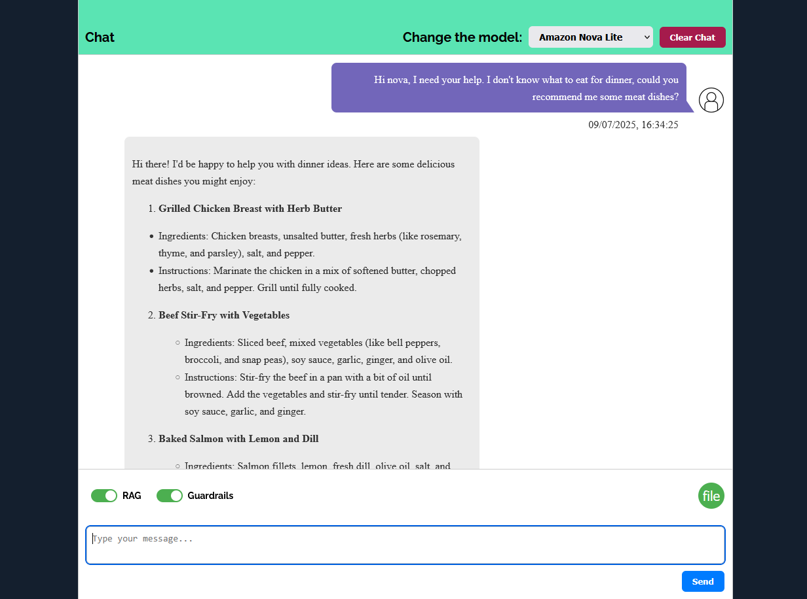
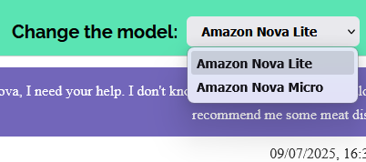
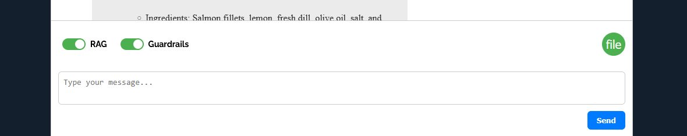

# ChatBot with AWS Bedrock

## Warning
**This project does not adopt a specific software architecture, as it was developed in a short timeframe and is intended as a practical exercise in interfacing with a generative AI model (AWS Bedrock).**

# Table of Contents

1. [About](#about)
1. [Key Feature](#key-feature)
1. [Requirements](#requirements)
1. [Our Development Team](#our-development-team)

## About

This project is a Python web application designed to demonstrate how a chatbot based on a generative AI model operates. It was developed as a learning exercise to explore interfacing with [AWS Bedrock](https://aws.amazon.com/bedrock/) and its features, with the support of [**Storm Reply**](https://www.reply.com/storm-reply/it) company. The application uses [Python](https://docs.python.org/3/) with [Flask](https://flask.palletsprojects.com/en/stable/) and [Flask-SocketIO](https://flask-socketio.readthedocs.io/en/latest/) to enable real-time communication between the user and the model, and integrates [LanceDB](https://www.lancedb.com/) to support Retrieval-Augmented-Generation ([RAG](https://aws.amazon.com/what-is/retrieval-augmented-generation/))for enhanced context retrieval during conversations.

## Key Feature

1. ### Model Selection

    Users can choose between different modedls (e.g., **Amazon Nova Lite**, **Amazon Nova Micro**) depending on their needs.
    

1. ### Clear Chat History

    users can clear the chat at any time, allowing the model to forget the previous conversation and start fresh for a new session.

1. ### Guardrails Toggle

    Users can **activate or deactivate Guardrails** for the conversation. When activated, the model applies safety and compliance checks during generation.

1. ### Retrieval-Augmented Generation (RAG)

    Users can enable **RAG mode** to allow the model to retrive and use relevant context from uploaded documents fro more accurate answers.

1. ### Document Upload with RAG

    When RAG is active, users can **upload** `.txt` **documents** to enhance the model's knowledge during the chat. The uploaded files are used to retrive relevant chunks dynamically for grounded responses.

## Requirements

Installation on local server requirements:

1. Install python([python Downlaod](https://www.python.org/downloads/)) on your machine
1. Python library to download (`pip install`):
    1. [Flask](https://flask.palletsprojects.com/en/stable/)
    1. [Flask-SocketIO](https://flask-socketio.readthedocs.io/en/latest/)
    1. [Boto3](https://boto3.amazonaws.com/v1/documentation/api/latest/index.html) (AWS SDK)
    1. [LanceDB](https://www.lancedb.com/)
    1. [Pandas](https://pandas.pydata.org/)

## Our Development Team

- [flebo45](https://github.com/flebo45)